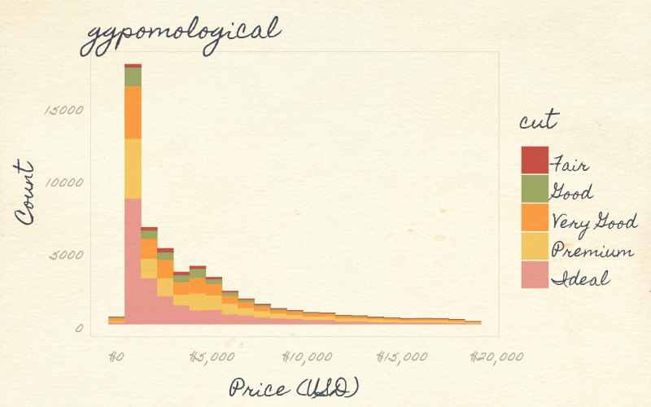
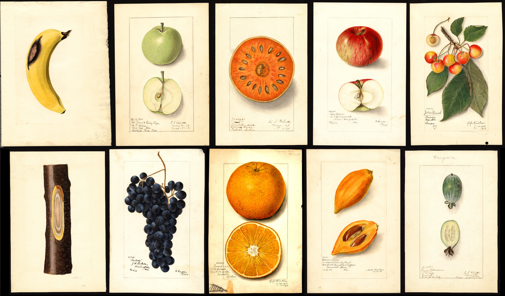
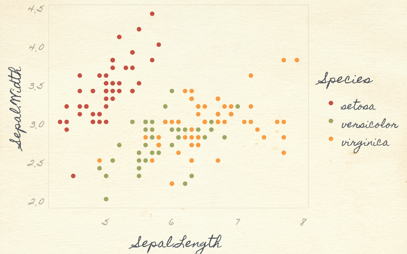
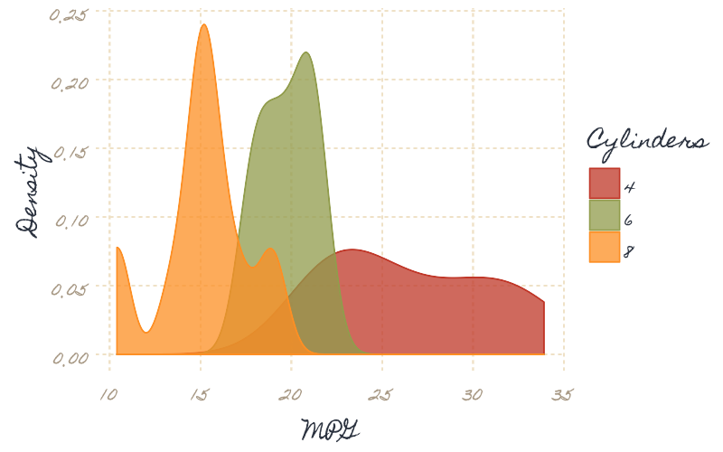
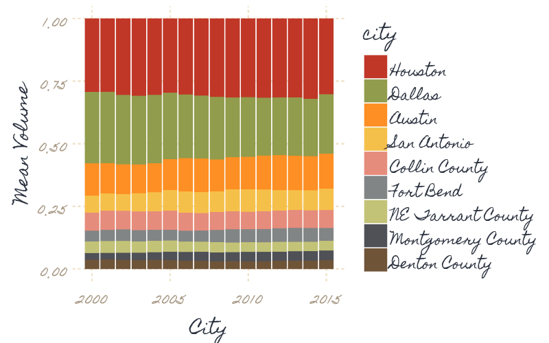
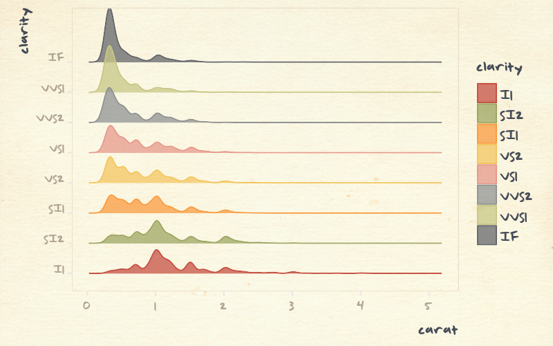

```{r setup, include=FALSE}
knitr::opts_chunk$set(echo = TRUE, fig.width=8, fig.height=5)
library(ggpomological)
library(dplyr)
```

## Pomological Plots


<!-- Links -->
[rstudioconf]:   https://www.rstudio.com/conference/
[t-aronatkins]:  https://twitter.com/aronatkins
[rsconf-slides]: https://github.com/rstudio/rstudio-conf/tree/master/2018/Fruit_For_Thought--Aron_Atkins
[rsconf-video]:  https://youtu.be/Ol1FjFR2IMU?t=5h21m15s
[usda-pom]:      https://usdawatercolors.nal.usda.gov/pom
[t-pomological]: https://twitter.com/pomological
[magick]:        https://cran.r-project.org/web/packages/magick/index.html

This package provides a ggplot2 theme inspired by the [USDA Pomological Watercolors collection][usda-pom] and by Aron Atkins's ([\@aronatkins][t-aronatkins]) [talk on parameterized RMarkdown][rsconf-video] at [rstudio::conf 2018][rstudioconf].





## Installation

This package isn't on CRAN, so you'll need to use the devtools package to install it.

```r
# If you don't have devtools installed
install.packages("devtools")

devtools::install_github("gadenbuie/ggpomological")
```

## Color Palette

The colors for this theme were drawn from many images from the [USDA Pomological Watercolors collection][usda-pom], I chose just a few that I thought worked well together for color and fill scales

```{r}
scales::show_col(ggpomological:::pomological_palette)
```

and a few colors for the plot background and decoration

```{r}
scales::show_col(unlist(ggpomological:::pomological_base))
```

I've also included a [css file](inst/pomological.css) with the complete collection of color samples.


## Setup theme and scales

There are three theme-generating functions: 

- `theme_pomological()` sets the plot theme to be representative of the paper and styling of the watercolors and includes a paper-colored background, 

- `theme_pomological_nobg()` has the same styling, just with a transparent (or white) background,

- `theme_pomological_plain()` has a white background and doesn't change the font unless requested.

A handwriting font is needed for the fully authentic pomological look, and I found a few from Google Fonts that fit the bill.

- [Mr. De Haviland](https://fonts.google.com/specimen/Mr+De+Haviland)
- [Homemade Apple](https://fonts.google.com/specimen/Homemade+Apple/)
- [Marck Script](https://fonts.google.com/specimen/Marck+Script/)
- [Mr. Bedfort](https://fonts.google.com/specimen/Mr+Bedfort/)

Alternatively, use something like [calligrapher.com](https://www.calligraphr.com/) to create your own handwriting font!

For color and fill scales, **ggpomological** provides `scale_color_pomological()` and `scale_fill_pomological()`.

In the future, I might revisit this package to

1. Increase colors in discrete scale

2. Setup paired color scales. Lots of great color pairs in the extracted colors.

3. Set up continuous scale colors (we'll see...)


## Add paper background!

**ggpomological** also provides a function named `paint_pomological` that uses the [`magick`][magick] package to add a pomological watercolor paper background and a subtle texture overlay.


## Demo!

We'll need ggplot2 (loaded with **ggpomological**) and dplyr

```r
library(ggpomological)
library(dplyr)
```

### Basic iris plot

```{r plot-demo}
# Base plot
basic_iris_plot <- ggplot(iris) +
  aes(x = Sepal.Length, y = Sepal.Width, color = Species) +
  geom_point(size = 2)

# Just your standard Iris plot
basic_iris_plot 

# With pomological colors
basic_iris_plot <- basic_iris_plot + scale_color_pomological()
basic_iris_plot

# With pomological theme
pomological_iris <- basic_iris_plot + theme_pomological()
pomological_iris

# With transparent background
basic_iris_plot + theme_pomological_nobg() 

# Or with "plain" pomological
basic_iris_plot + theme_pomological_plain() 

# Painted!
paint_pomological(pomological_iris, res = 110) %>% 
  magick::image_write("Readme_files/figure-gfm/plot-demo-painted.png")
```



### Stacked bar chart


```{r plot-bar-chart}
stacked_bar_plot <- ggplot(diamonds) +
  aes(price, fill = cut) +
  geom_histogram(binwidth = 850) + 
  xlab('Price (USD)') + 
  ylab('Count') + 
  ggtitle("ggpomological") +
  scale_x_continuous(label = scales::dollar_format()) +
  scale_fill_pomological()

stacked_bar_plot + theme_pomological()

paint_pomological(
  stacked_bar_plot + theme_pomological_nobg(),
  res = 110
) %>% 
  magick::image_write("Readme_files/figure-gfm/plot-bar-chart-painted.png")
```


### Density Plot

```{r plot-density}
density_plot <- mtcars %>% 
  mutate(cyl = factor(cyl)) %>% 
  ggplot() +
  aes(mpg, fill = cyl, color = cyl)+
  geom_density(alpha = 0.75) + 
  labs(fill = 'Cylinders', colour = 'Cylinders', x = 'MPG', y = 'Density') +
  scale_color_pomological() +
  scale_fill_pomological()

density_plot + theme_pomological()

paint_pomological(
  density_plot + theme_pomological_nobg(),
  res = 110
) %>% 
  magick::image_write("Readme_files/figure-gfm/plot-density-demo-painted.png")
```




### Points and lines

Data from the Texas Housing

```{r plot-full-bar-stack}
big_volume_cities <- txhousing %>% 
  group_by(city) %>% 
  summarize(mean_volume = mean(volume, na.rm = TRUE)) %>% 
  arrange(-mean_volume) %>% 
  top_n(length(ggpomological:::pomological_palette)) %>% 
  pull(city)

full_bar_stack_plot <- txhousing %>% 
  filter(city %in% big_volume_cities) %>% 
  group_by(city, year) %>% 
  summarize(mean_volume = mean(volume, na.rm = TRUE)) %>% 
  ungroup %>% 
  mutate(city = factor(city, big_volume_cities)) %>% 
  ggplot() +
  aes(year, mean_volume, fill = city, group = city) +
  geom_col(position = 'fill', width = 0.9) +
  labs(x = 'City', y = 'Mean Volume', color = 'City') +
  theme(panel.grid.minor.x = element_blank()) +
  scale_fill_pomological()

full_bar_stack_plot + theme_pomological()

paint_pomological(
  full_bar_stack_plot + theme_pomological_nobg(),
  res = 110
) %>% 
  magick::image_write("Readme_files/figure-gfm/plot-full-bar-stack-painted.png")
```



### One last plot

Using my own handwriting and the `ggridges` package.

```{r plot-ridges}
ridges_pomological <- ggplot(diamonds) + 
  aes(x = carat, y = clarity, color = clarity, fill = clarity) + 
  ggridges::geom_density_ridges(alpha = 0.75) + 
  theme_pomological_nobg(
    base_family = 'gWriting',
    base_size = 20,
    base_theme = ggridges::theme_ridges()
    ) + 
  scale_fill_pomological() + 
  scale_color_pomological()

paint_pomological(ridges_pomological, res = 110) %>% 
  magick::image_write("Readme_files/figure-gfm/plot-ridges-painted.png")
```


