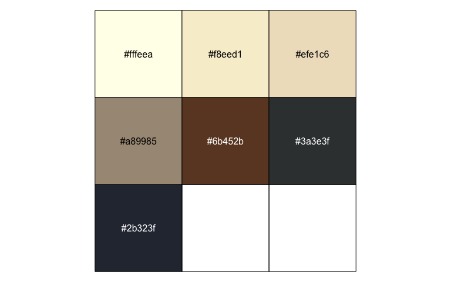

Pomological Colors
================
Garrick Aden-Buie

## Installation

This package isn’t on CRAN, so you’ll need to use the devtools package
to install it.

``` r
# If you don't have devtools installed
install.packages("devtools")

devtools::install_github("gadenbuie/ggpomological")

# To include the vignette
devtools::install_github("gadenbuie/ggpomological", build_vignettes=TRUE)
```

## Introduction

<!-- Links -->

This package provides a ggplot2 theme inspired by the [USDA Pomological
Watercolors collection](https://usdawatercolors.nal.usda.gov/pom) and by
Aron Atkins’s ([@aronatkins](https://twitter.com/aronatkins)) [talk on
parameterized RMarkdown](https://youtu.be/Ol1FjFR2IMU?t=5h21m15s) at
[rstudio::conf 2018](https://www.rstudio.com/conference/).

<!-- -->

<!-- -->\[1\]

## Color Palette

The colors for this theme were drawn from many images from the [USDA
Pomological Watercolors
collection](https://usdawatercolors.nal.usda.gov/pom), I chose just a
few that I thought worked well together for color and fill scales

``` r
scales::show_col(ggpomological:::pomological_palette)
```

<!-- -->

and a few colors for the plot background and decoration

``` r
scales::show_col(unlist(ggpomological:::pomological_base))
```

<!-- -->

I’ve also included a [css file](inst/pomological.css) with the complete
collection of color samples.

## Setup theme and scales

There are three theme-generating functions:

  - `theme_pomological()` sets the plot theme to be representative of
    the paper and styling of the watercolors and includes a
    paper-colored background,

  - `theme_pomological_plain()` has the same styling, just with a
    transparent (or white) background,

  - `theme_pomological_fancy()` has the paper-colored background and
    defaults to a fancy handwritten font ([Homemade
    Apple](https://fonts.google.com/specimen/Homemade+Apple/)).

For color and fill scales, **ggpomological** provides
`scale_color_pomological()` and `scale_fill_pomological()`.

In the future, I might revisit this package to

1.  Increase colors in discrete scale

2.  Setup paired color scales. Lots of great color pairs in the
    extracted colors.

3.  Set up continuous scale colors (we’ll see…)

## Fonts

A handwriting font is needed for the fully authentic pomological look,
and I found a few from Google Fonts that fit the bill.

  - [Mr. De Haviland](https://fonts.google.com/specimen/Mr+De+Haviland)
  - [Homemade Apple](https://fonts.google.com/specimen/Homemade+Apple/)
  - [Marck Script](https://fonts.google.com/specimen/Marck+Script/)
  - [Mr. Bedfort](https://fonts.google.com/specimen/Mr+Bedfort/)

Alternatively, use something like
[calligrapher.com](https://www.calligraphr.com/) to create your own
handwriting font\!

But fonts can be painful in R, so the base functions –
`theme_pomological()` and `theme_pomological_plain()` – don’t change the
font by default. To opt into the full pomological effect, use
`theme_pomological_fancy()` which is just an alias for
`theme_pomological(base_family = "Homemade Apple", base_size = 16)`.

## Add paper background\!

**ggpomological** also provides a function named `paint_pomological`
that uses the
[`magick`](https://cran.r-project.org/web/packages/magick/index.html)
package to add a pomological watercolor paper background and a subtle
texture overlay.

## Demo\!

We’ll need ggplot2 (loaded with **ggpomological**) and dplyr

``` r
library(ggpomological)
library(dplyr)
```

**Warning**: If you don’t have the [above fonts](#fonts) installed,
you’ll get an error message with a lot of warnings when running the
below examples. Just replace `theme_pomological("Homemade Apple", 16)`
with `theme_pomological()` for the basic theme without the crazy fonts.

### Basic iris plot

``` r
# Prep msleep data
msleep <- ggplot2::msleep[, c("vore", "sleep_rem", "sleep_total")]
msleep <- msleep[complete.cases(msleep), ]
msleep$vore <- paste0(msleep$vore, "vore")

# Base plot
basic_msleep_plot <- ggplot(msleep) +
  aes(x = sleep_rem, y = sleep_total, color = vore) +
  geom_point(size = 2) +
  labs(color = NULL)

# Just your standard ggplot
basic_msleep_plot 
```

<!-- -->

``` r

# With pomological colors
basic_msleep_plot <- basic_msleep_plot + scale_color_pomological()
basic_msleep_plot
```

<!-- -->

``` r

# With pomological theme
basic_msleep_plot + theme_pomological()
```

<!-- -->

``` r

# With transparent background
basic_msleep_plot + theme_pomological_plain() 
```

<!-- -->

``` r

# Or with "fancy" pomological settings
pomological_msleep <- basic_msleep_plot + theme_pomological_fancy()

# Painted!
paint_pomological(pomological_msleep, res = 110)
```

<!-- -->

### Stacked bar chart

``` r
stacked_bar_plot <- ggplot(diamonds) +
  aes(price, fill = cut) +
  geom_histogram(binwidth = 850) + 
  xlab('Price (USD)') + 
  ylab('Count') + 
  ggtitle("ggpomological") +
  scale_x_continuous(labels = scales::dollar_format()) +
  scale_fill_pomological()

stacked_bar_plot + theme_pomological("Homemade Apple", 16)
```

<!-- -->

``` r

paint_pomological(
  stacked_bar_plot + theme_pomological_fancy("Homemade Apple"),
  res = 110
)
```

<!-- -->

### Density Plot

``` r
density_plot <- mtcars %>% 
  mutate(cyl = factor(cyl)) %>% 
  ggplot() +
  aes(mpg, fill = cyl, color = cyl)+
  geom_density(alpha = 0.75) + 
  labs(fill = 'Cylinders', colour = 'Cylinders', x = 'MPG', y = 'Density') +
  scale_color_pomological() +
  scale_fill_pomological()

density_plot + theme_pomological("Homemade Apple", 16)
```

<!-- -->

``` r

paint_pomological(
  density_plot + theme_pomological_fancy(),
  res = 110
)
```

<!-- -->

### Points and lines

Data from the Texas Housing

``` r
big_volume_cities <- txhousing %>% 
  group_by(city) %>% 
  summarize(mean_volume = mean(volume, na.rm = TRUE)) %>% 
  arrange(-mean_volume) %>% 
  top_n(length(ggpomological:::pomological_palette)) %>% 
  pull(city)
#> Selecting by mean_volume

full_bar_stack_plot <- txhousing %>% 
  filter(city %in% big_volume_cities) %>% 
  group_by(city, year) %>% 
  summarize(mean_volume = mean(volume, na.rm = TRUE)) %>% 
  ungroup %>% 
  mutate(city = factor(city, big_volume_cities)) %>% 
  ggplot() +
  aes(year, mean_volume, fill = city, group = city) +
  geom_col(position = 'fill', width = 0.9) +
  labs(x = 'City', y = 'Mean Volume', color = 'City') +
  theme(panel.grid.minor.x = element_blank()) +
  scale_fill_pomological()

full_bar_stack_plot + theme_pomological("Homemade Apple", 16)
```

<!-- -->

``` r

paint_pomological(
  full_bar_stack_plot + theme_pomological_fancy(),
  res = 110
)
```

<!-- -->

### One last plot

Using my own handwriting and the `ggridges` package.

``` r
ridges_pomological <- ggplot(diamonds) + 
  aes(x = carat, y = clarity, color = clarity, fill = clarity) + 
  ggridges::geom_density_ridges(alpha = 0.75) + 
  theme_pomological(
    base_family = 'gWriting',
    base_size = 20,
    base_theme = ggridges::theme_ridges()
    ) + 
  scale_fill_pomological() + 
  scale_color_pomological()

paint_pomological(ridges_pomological, res = 110)
#> Picking joint bandwidth of 0.057
```

<!-- -->

1.  U.S. Department of Agriculture Pomological Watercolor Collection.
    Rare and Special Collections, National Agricultural Library,
    Beltsville, MD 20705
